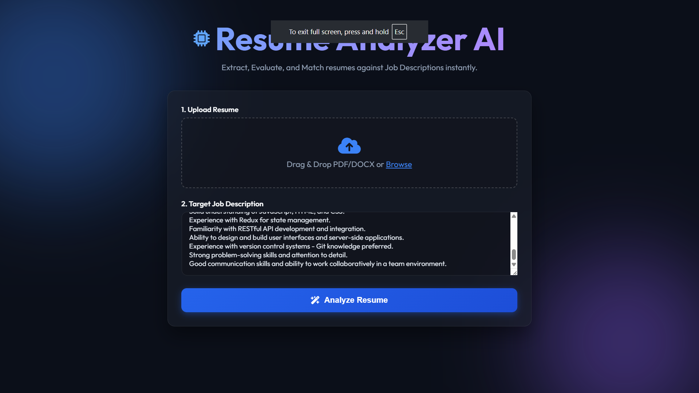
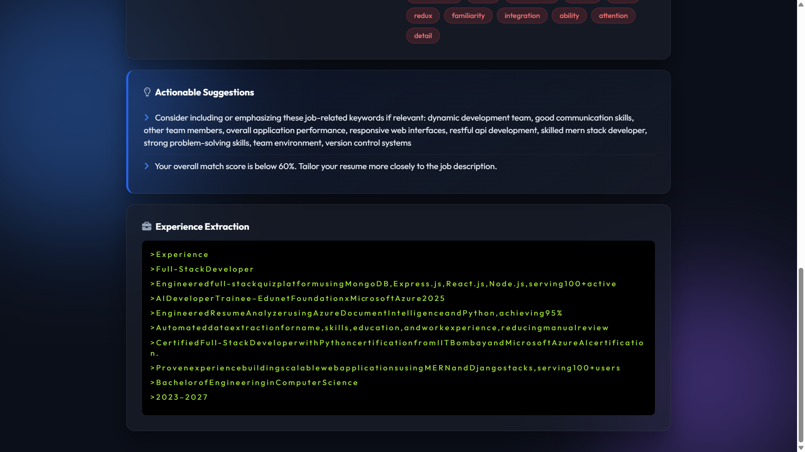

# Resume Analyzer AI

A high-end, AI-powered Resume Analyzer built with Python and Azure AI Text Analytics. It extracts and evaluates key information from resumes (PDF/DOCX) to assist recruiters in faster screening, matching candidates to Job Descriptions intelligently.

## 🚀 Recent Updates
- **Premium UI/UX Overhaul**: Completely modernized frontend featuring a sleek dark mode, glassmorphism UI, circular SVG progress bars, and CSS keyframe animations.
- **Drag & Drop Upload**: Upgraded from basic file inputs to an interactive drag-and-drop zone.
- **Vercel Serverless Ready**: Completely reconfigured the backend with a `vercel.json` file and `/tmp` writing to flawlessly deploy on Vercel's serverless infrastructure.
- **Toast Notifications & Overlays**: Added non-blocking toasts and an animated loading screen for a smooth user experience.

## ✨ Features

- **Automated Resume Parsing**: Upload resumes (PDF/DOCX) and extract Name, Email, Phone, Skills, and Work Experience.
- **Job Matching (Score)**: Analyzes JD vs Resume to calculate a concrete Match Percentage.
- **Keyword Check**: Visually maps out Found vs Missing keywords.
- **Azure AI Document Intelligence**: High accuracy entity recognition (NER) under the hood.
- **Web Interface**: Lightweight backend handled by **Flask**.

---

## 📸 Screenshots

*(Replace these image paths with actual screenshots of your new dashboard!)*


*Modern Drag-and-Drop Interface*


*Detailed Azure AI Analysis Dashboard*

---

## 🛠️ Tech Stack

- **Backend**: Python, Flask, Werkzeug
- **AI Service**: Azure AI Text Analytics (`azure-ai-textanalytics`)
- **Frontend**: HTML5, CSS3 (Glassmorphism + Dark Theme), Vanilla JavaScript
- **Deployment**: [Vercel](https://vercel.com/) & [Render](https://render.com/) ready

## 🔑 Environment Variables

To run this project, add your Azure credentials to a `.env` file at the root:

```env
AZURE_LANGUAGE_ENDPOINT=https://your-endpoint.cognitiveservices.azure.com/
AZURE_LANGUAGE_KEY=your_azure_super_secret_key
```
> **Note for Vercel:** Add these directly to your Vercel Project Settings > Environment Variables.

## 🚀 Setup & Run Instructions

### 1. Requirements

Ensure you have Python 3 installed. Then, clone the repository:

```bash
git clone https://github.com/yeshu2006/resume-analyser.git
cd resume-analyser
```

### 2. Virtual Environment (Windows)

```powershell
# Create environment
python -m venv .venv

# Activate it
.\.venv\Scripts\Activate.ps1

# Install Dependencies
pip install -r requirements.txt
```

### 3. Run Locally

```powershell
python app.py
```
Open `http://127.0.0.1:5000` in your browser.

## ☁️ Vercel Deployment
To deploy on Vercel:
1. Connect your GitHub repository to Vercel.
2. In Vercel Project Settings, navigate to **Environment Variables** and add `AZURE_LANGUAGE_ENDPOINT` and `AZURE_LANGUAGE_KEY`.
3. Vercel will automatically use the `vercel.json` file to build and serve the application as a serverless backend.
